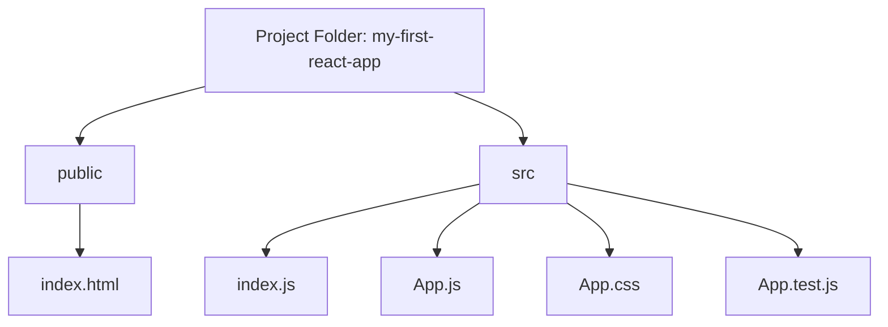

## **Session 1: React: A New Way to Build!** 🚀

### **1. Introduction to React**

**React** is a powerful library that helps us build modern websites. But what does that mean? Let’s start by understanding why we need React.

#### **1.1 Why React?**
Imagine you're building a LEGO house. Without React, you'd be building it piece by piece, sticking them together manually. But with React, you get pre-built LEGO blocks that you can easily put together to create your house faster and with less effort!

React allows us to:
- **Create Reusable Components**: Just like LEGO blocks, you can use the same pieces over and over in different parts of your project.
- **Make Interactive Websites**: React helps you create websites that respond to users, like buttons that change when you click them.
- **Organize Your Code Better**: React makes it easier to keep your code neat and tidy, so you don't get lost in it!

#### **1.2 What We'll Build with React**
In this module, we'll use React to build interactive websites, like to-do lists, quizzes, and even a mini social network! You'll see how React makes all of this easier and more fun.

### **2. Setting Up React**

Before we start building with React, we need to set up our environment. This means getting the tools we need on our computers.

#### **2.1 Installing Node.js and npm**
React uses a tool called **Node.js** to run its code. We also need **npm** (Node Package Manager), which helps us install React and other tools.

**Steps to Install Node.js and npm**:
1. Go to the [Node.js website](https://nodejs.org/).
2. Download the recommended version for your operating system.
3. Follow the installation instructions.

After installing, open your terminal or command prompt and type:
```
node -v
npm -v
```
You should see the versions of Node.js and npm, which means they are installed correctly!

#### **2.2 Creating Your First React App**

Now that Node.js and npm are ready, let's create our first React app using the command line.

**Steps to Create a React App**:
1. Open your terminal or command prompt.
2. Navigate to the directory where you want to create your project.
3. Type the following command:
   ```
   npx create-react-app my-first-react-app
   ```
4. This command will create a new folder called `my-first-react-app` with all the necessary files to start your React project.
5. Navigate into your project folder:
   ```
   cd my-first-react-app
   ```
6. Start your React app by typing:
   ```
   npm start
   ```
7. Your browser will automatically open with your first React app running on `http://localhost:3000/`.

### **3. Understanding the React Structure**

When you open your React app in a code editor like Visual Studio Code, you'll see several files and folders. Let's break them down.

#### **3.1 Important Files in a React Project**
- **`public/index.html`**: This is the main HTML file where your React app gets loaded.
- **`src/index.js`**: This file is the entry point of your React application. It tells React where to start rendering your app.
- **`src/App.js`**: This is where you'll write most of your code. It's the main component that gets displayed on the screen.

Here's a visual representation of the file structure:



### **4. Diving into Components**

In React, everything is built using **components**. Components are like LEGO blocks – you build your website by stacking these blocks together.

#### **4.1 What is a Component?**
A **component** is a piece of your website. It could be a button, a header, a footer, or even a whole section of a webpage. In React, components can be reused across different parts of your app, making your code cleaner and more efficient.

Let's create a simple component in your `App.js` file.

```javascript
import React from 'react';

function Welcome() {
  return (
    <div>
      <h1>Welcome to My First React App!</h1>
      <p>This is a simple component.</p>
    </div>
  );
}

export default Welcome;
```

In this example, `Welcome` is a component that displays a heading and a paragraph.

#### **4.2 Rendering a Component**
To display this component, we need to render it inside our main `App.js` file.

Modify your `App.js` to look like this:

```javascript
import React from 'react';
import Welcome from './Welcome';

function App() {
  return (
    <div className="App">
      <Welcome />
    </div>
  );
}

export default App;
```

Now, when you run your React app, you'll see "Welcome to My First React App!" on the screen. Congrats! You've just created and rendered your first React component!

### **5. Understanding JSX**

In React, we use something called **JSX** to write our components. JSX looks like HTML, but it’s actually JavaScript under the hood.

#### **5.1 What is JSX?**
JSX allows us to write HTML-like syntax directly in our JavaScript code. It makes it easier to create and visualize components.

For example:

```jsx
const element = <h1>Hello, world!</h1>;
```

This JSX code is compiled into JavaScript that looks like this:

```javascript
const element = React.createElement('h1', null, 'Hello, world!');
```

JSX is easier to write and read, making React development more fun!

### **6. Running Your React App**

Now that we've set up React, created a component, and learned about JSX, let's run our app to see everything in action!

1. Make sure your development server is running (`npm start`).
2. Open your browser and go to `http://localhost:3000`.
3. You should see your "Welcome to My First React App!" message.

If you see the message, congratulations! You've successfully set up your first React app and created your first component!

### **7. Recap and What's Next**

In this session, you’ve learned:
- What React is and why it’s powerful.
- How to set up your React environment.
- The basic structure of a React project.
- How to create and render components.
- What JSX is and how it simplifies writing React code.

Next time, we’ll dive deeper into components and learn how to pass data between them using props. We’ll also explore how to make your website dynamic and responsive with React state.

### **8. Interactive Challenge: Create Your First Custom Component**

Now that you’ve learned the basics, here’s a fun challenge:

1. Create a new component called `Greeting.js`.
2. In this component, display a custom greeting message.
3. Import your `Greeting` component into `App.js` and render it.

Here’s a hint to get you started:

```javascript
// Greeting.js
import React from 'react';

function Greeting() {
  return (
    <div>
      <h1>Hello, React Developer!</h1>
    </div>
  );
}

export default Greeting;
```

Good luck, and have fun experimenting with your first React components!

---

### **Additional Resources:**
- [React Documentation](https://reactjs.org/docs/getting-started.html) - For further reading and reference.
- [Visual Studio Code](https://code.visualstudio.com/) - Download and use this popular code editor for React development.
- [MDN Web Docs: JSX](https://developer.mozilla.org/en-US/docs/Web/JavaScript/Reference/Template_literals) - Learn more about JSX and how it works.

--- 

### **Online example fo the start page:***
- [https://create-react-app-vercel-mocha-ten.vercel.app/](https://create-react-app-vercel-mocha-ten.vercel.app/)
