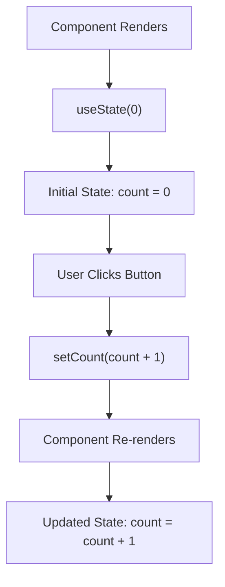

## **Session 4: React State: Make Things Change!** 🔄

#### **Objective:**
By the end of this session, students will understand how to manage dynamic data within a component using state and be able to build a simple counter app.

### **1. Introduction to React State**

**What is State?**
- In React, **state** is like a container that holds information about a component. This information can change over time.
- Think of state as the "memory" of a component. It remembers things like the number of clicks on a button, the text typed into a box, or whether a light is on or off.

**Why Do We Need State?**
- In web applications, we often need to keep track of changing information. For example, in a game, we need to know the score; in a shopping cart, we need to know which items have been added.
- State allows components to be dynamic and responsive. When state changes, React automatically updates the part of the UI that depends on it.

### **2. Using State in a React Component**

Let's look at how to use state in a React component.

**Step 1: Import the `useState` Hook**
- React provides a special tool called a **hook** to use state in function components.
- The `useState` hook is the most common and is used to add state to a component.

**Code Example:**
```javascript
import React, { useState } from 'react';

function Counter() {
  const [count, setCount] = useState(0);

  return (
    <div>
      <p>You clicked {count} times</p>
      <button onClick={() => setCount(count + 1)}>
        Click me
      </button>
    </div>
  );
}

export default Counter;
```

**Explanation:**
- We start by importing the `useState` hook from React.
- Inside the `Counter` component, we declare a state variable `count` and a function `setCount` to update the state.
- The `useState(0)` call initializes the state to `0`.
- We use the state in our JSX with `{count}` and update it when the button is clicked using `setCount(count + 1)`.

**Interactive Activity:**
- Ask students to change the initial value of `count` and see how it affects the app.
- Have them modify the button to decrease the count instead of increasing it.

### **3. Visualizing State Changes**

To help students understand how state works, we can use a simple diagram.

**Mermaid Diagram:**



**Explanation:**
- The diagram shows the flow of how state is initialized, updated, and causes the component to re-render.

### **4. Practical Example: Building a Simple Counter**

Let's build a simple counter app step by step.

**Step 1: Create a New React App**
- First, we'll create a new React app using `create-react-app`.

```bash
npx create-react-app my-counter-app
cd my-counter-app
npm start
```

**Step 2: Add a Counter Component**
- Replace the content of `App.js` with the following code:

```javascript
import React, { useState } from 'react';

function Counter() {
  const [count, setCount] = useState(0);

  return (
    <div>
      <h1>Simple Counter</h1>
      <p>Current Count: {count}</p>
      <button onClick={() => setCount(count + 1)}>Increase</button>
      <button onClick={() => setCount(count - 1)}>Decrease</button>
      <button onClick={() => setCount(0)}>Reset</button>
    </div>
  );
}

export default Counter;
```

**Step 3: Styling the Counter**
- We can add some basic CSS to make our counter look better. Create a `Counter.css` file:

```css
div {
  text-align: center;
  margin-top: 50px;
}

button {
  margin: 10px;
  padding: 10px 20px;
  font-size: 16px;
}
```

**Step 4: Import the CSS into `App.js`**

```javascript
import './Counter.css';
```

**Step 5: Run the App**
- Start the app by running `npm start` and see the counter in action.

**Interactive Activity:**
- Ask students to add more buttons to double or halve the count.
- Encourage them to explore what happens when they set the state directly without using `setCount`.

### **5. Common Pitfalls with State**

**1. State Doesn’t Update Immediately**
- When you call `setCount`, the state doesn’t change immediately. Instead, React schedules a re-render with the new state. This can cause confusion if you expect the state to change instantly.

**2. Avoid Direct State Modification**
- Never directly modify the state. For example, `count = count + 1` is incorrect. Always use the setter function provided by `useState`.

**Interactive Quiz:**
- Prepare a few true/false or multiple-choice questions to test the students' understanding. Example: "True or False: You should directly modify the state variable to update its value."

### **6. Extending the Counter App: Adding More Features**

Once students are comfortable with the basic counter, introduce a few more features.

**Feature 1: Adding a Step**
- Allow the user to define how much the count should increase or decrease with each click.

```javascript
function Counter() {
  const [count, setCount] = useState(0);
  const [step, setStep] = useState(1);

  return (
    <div>
      <h1>Step Counter</h1>
      <p>Current Count: {count}</p>
      <input
        type="number"
        value={step}
        onChange={(e) => setStep(Number(e.target.value))}
      />
      <button onClick={() => setCount(count + step)}>Increase</button>
      <button onClick={() => setCount(count - step)}>Decrease</button>
      <button onClick={() => setCount(0)}>Reset</button>
    </div>
  );
}
```

**Feature 2: Limiting the Count**
- Add a feature to prevent the count from going below zero.

```javascript
function Counter() {
  const [count, setCount] = useState(0);
  const [step, setStep] = useState(1);

  return (
    <div>
      <h1>Non-Negative Counter</h1>
      <p>Current Count: {count}</p>
      <input
        type="number"
        value={step}
        onChange={(e) => setStep(Number(e.target.value))}
      />
      <button onClick={() => setCount(Math.max(0, count + step))}>Increase</button>
      <button onClick={() => setCount(Math.max(0, count - step))}>Decrease</button>
      <button onClick={() => setCount(0)}>Reset</button>
    </div>
  );
}
```

**Interactive Activity:**
- Have students think of other features they could add, such as a maximum limit for the counter or a history of previous counts.

### **7. Wrapping Up: Key Takeaways**

- **State** is crucial for making React components dynamic and interactive.
- The `useState` hook allows you to add state to your function components.
- React’s reactivity means that when state changes, the UI automatically updates to reflect those changes.
- Always use the setter function provided by `useState` to update state.

### **8. Interactive Recap and Challenge**

**Recap Activity:**
- Ask students to explain state in their own words.
- Have them draw their own diagrams of how state flows in a React component.

**Challenge:**
- As a final challenge, ask students to create a countdown timer using what they've learned about state. The timer should start from a specified number and decrease every second until it reaches zero.

### **9. Additional Resources**

- **React Docs**: Encourage students to explore the official React documentation on `useState` to deepen their understanding.
- **YouTube Tutorials**: Provide links to beginner-friendly React tutorials for additional practice.
